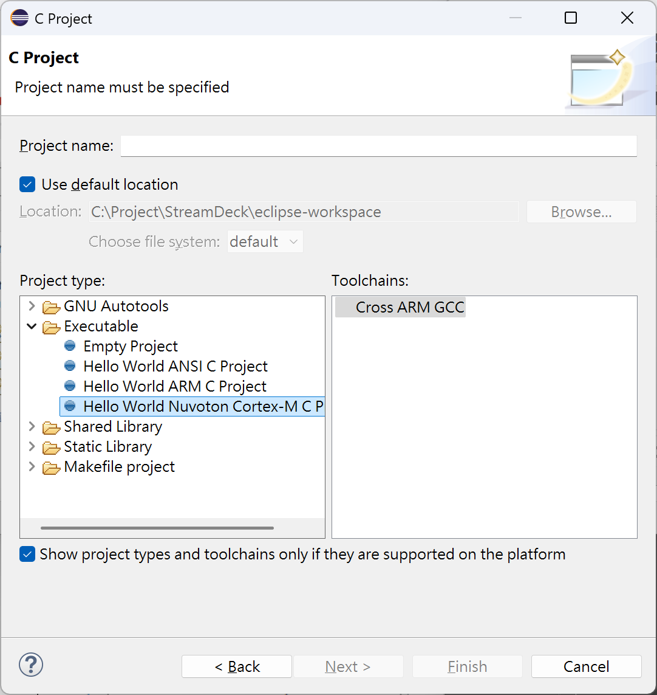

# Setup Development for Stream Deck
* Setup IDE (Eclipse)
* Setup SDK

# Setup NuEclipse
## Download NuEclipse
[NuEclipse (GCC)](https://www.nuvoton.com/tool-and-software/ide-and-compiler/)
    -NuEclipse_V1.02.029_Windows
        en-us--NuEclipse_V1.02.029r_Windows_Setup.zip
    -User Manual
        en-us--UM_NuEclipse_EN.pdf
## Install NuEclipse
Execute NuEclipse_V1.02.029r_Windows_Setup.exe to install
    ✅ GNU ARM Eclipse Windows Build Tools
    ✅ GNU ARM Embedded Toolchain 
    ✅ Nu-Link USB Driver
## Verify Installation
    -Window / Preferences / C/C++ > Build / Global Tools Paths  
   
    -Run/Debug / OpenOCD Nu-Link  
  
## Create Project (New Project Wizard)
    -From project Explorer, select "Crate a projecct"  
  
    -From New project wizard, select C/C++, C Project, and "Next"  
   
    -From C Project menu, select "Hello World Nuvoton Cortex-M C Project"
    -Enter Project name then "Next"  
     
## Import Existing Projects
    -From menu/File/Import, launch import wizard
    
    -Select General/Existing Projects into Workspace
    -Browse to project and click Finish
    

# Setup SDK
## Clone or Download  N9H20_NonOS_BSP-master.zip
[N9H20_NonOS_BSP]https://github.com/OpenNuvoton/N9H20_NonOS_BSP  
Extract to C:\Project\streamdeck-n9h20\N9H20_NonOS_BSP

## Download and Install emWin
[N9H20_emWin](https://www.nuvoton.com/products/microprocessors/arm9-mpus/-n9h-series/?group=Software&tab=2)  
Dwonalod File "en-us--N9H20_emWin_Package_20241111.zip"  
    -N9H20 emWin Quick Start Guide.pdf  
    -N9H20_emWin_NonOS.zip  
    -N9H20_Linux_emWin_Package_20241111.tar.gz  
    -README.txt  
Extract N9H20_emWin_NonOS.zip
    emWin
    GUIDemo
    SimpleDemo
    SimpleDemoAppWizard
    N9H20 emWin AppWizard Quick Start Guide.pdf
## Create emWin folder
cd C:\Project\streamdeck-n9h20\N9H20_NonOS_BSP\BSP\SampleCode  
mkdir emWin  
mv N9H20_emWin_NonOS\GUIDemo BSP\SampleCode\emWin  
mv N9H20_emWin_NonOS\SimpleDemo BSP\SampleCode\emWin  
mv N9H20_emWin_NonOS\SimpleDemoAppWizard BSP\SampleCode\emWin\
mv N9H20_emWin_NonOS\emWin BSP\ThirdParty  
## Verify  Installation
Import project GUIDemo, SimpleDemo, and build project

